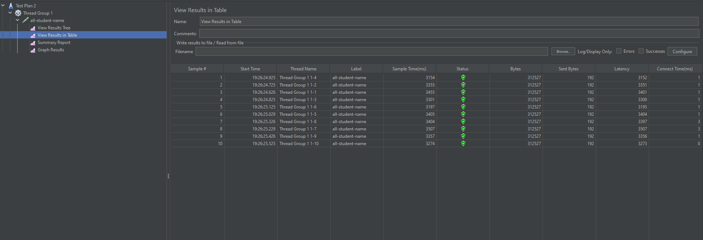
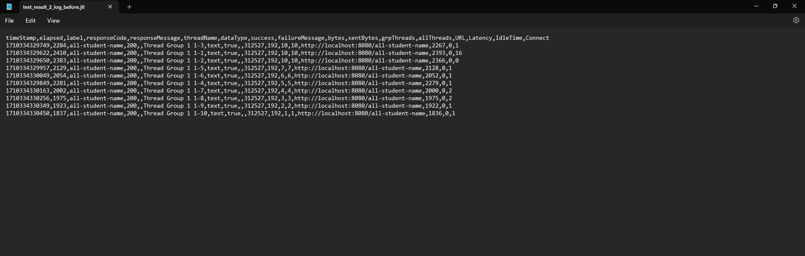
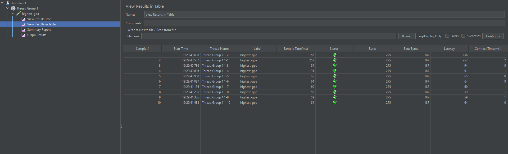
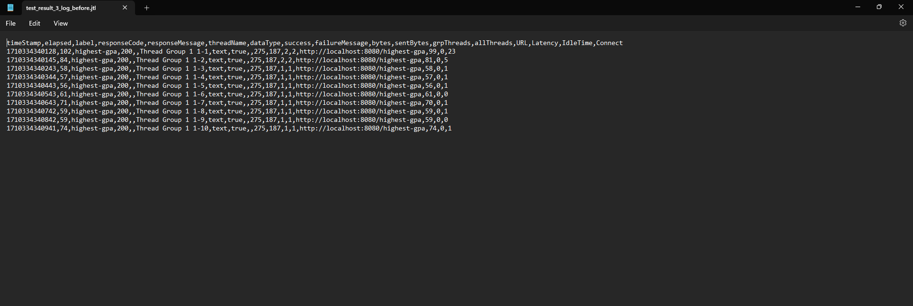
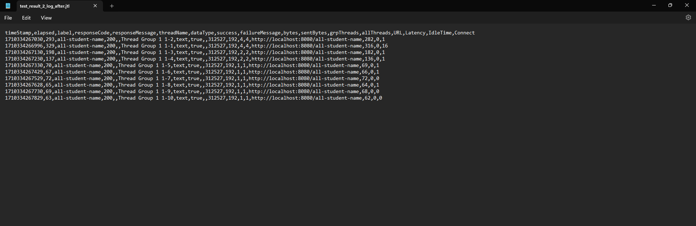
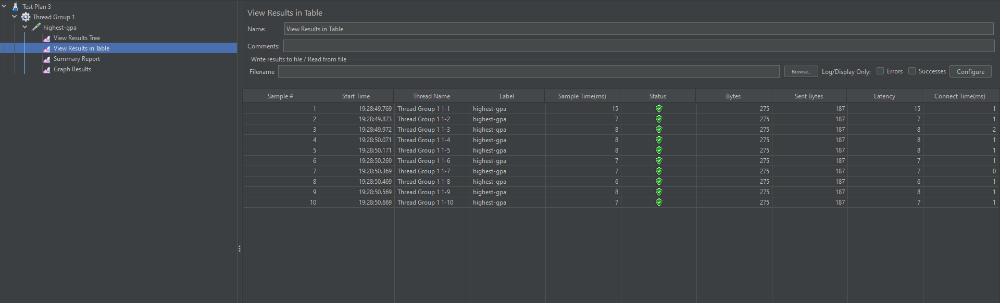
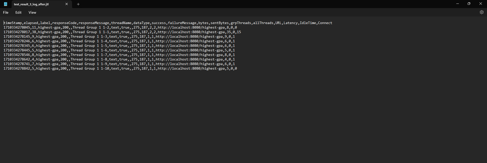

Nama: Zuhdy Nadhif Ayyasy

NPM : 2206081212

# Tutorial 5

### Comparison of Performance

##### Performance before optimization

1. JMeter all-student-name report

2. JMeter highest-gpa report

##### Performance after optimization

1. JMeter all-student-name report

Pada hasil before-after kondisi yang direpresentasikan pada gambar diatas, dapat dibandingkan bahwa terdapat peningkatan performa yang cukup signifikan setelah perbaikan pasca profiling yang lebih besar dari requirement (20%). Saya menambahkan `findFirstByOrderByGpaDesc()` pada service.

2. JMeter highest-gpa report

Pada hasil before-after kondisi yang direpresentasikan pada gambar diatas juga terlihat lebih dari requirement (20%). Hal ini terjadi ketika saya mengubah fungsi string concatination dengan menggunakan method append()
.

Adapun pada method yang terkait dengan all-student. Didapati bahwa peningkatan terjadi sangat signifikan hingga lebih dari requirement (20%)

### Reflection

##### 1. What is the difference between the approach of performance testing with JMeter and profiling with IntelliJ Profiler in the context of optimizing application performance?
   Pada Jmeter, kita hanya dapat mengetahui seberapa cepat dan efektifnya kode kita. Kita juga akan kesulitan ketika mencari titik kekurangan dari program yang kita buat. Sedangkan pada IntelliJ Profiler, kita bisa mengetahui letak kode yang menjadi penyebab rendahnya performa aplikasi yang kita jalankan.
##### 2. How does the profiling process help you in identifying and understanding the weak points in your application?
   Dengan menggunakan Profiler, kita bisa mengetahui letak kode yang menjadi penyebab rendahnya performa aplikasi yang kita jalankan. Dengan begitu, proses optimalisasi dan perbaikan kode bisa lebih efisien.
##### 3. Do you think IntelliJ Profiler is effective in assisting you to analyze and identify bottlenecks in your application code?
   Berdasarkan pengalaman saya menggunakan Jmeter dan Intellij Profiler, Intellij Profiler memberikan hasil yang lebih mudah difahami sehingga lebih efektif. Intellij Profiler memberikan letak kode yang menjadi penyebab rendahnya performa secara akurat dan tepat.
##### 4. What are the main challenges you face when conducting performance testing and profiling, and how do you overcome these challenges?
   Challenge utama dari performance testing dan profiling yang telah saya lakukan adalah ketika kita perlu melakukan berbagai setup seperti seeding. Hal ini cukup memakan waktu dan memerllukan alokasi power yang cukup dari laptop yang digunakan.
##### 5. What are the main benefits you gain from using IntelliJ Profiler for profiling your application code?
   Dengan menggunakan Intellij Profiler, kita bisa mengetahui letak kode yang menjadi penyebab rendahnya performa aplikasi yang kita jalankan. Saya cukup menjalankan testing dan profiling dengan beberapa kali klik kemudian bisa langsung melakukan perbaikan pada method atau potongan kode yang menjadi masalah, dan boom, problem solved.
##### 6. How do you handle situations where the results from profiling with IntelliJ Profiler are not entirely consistent with findings from performance testing using JMeter?
   Pertama, ada perbedaan yang cukup terlihat dari kedua alat testing. Yang saya rasakan, Jmeter terkesan melakukan testing terhadap keseluruhan kode pada program yang kita miliki. Sedangkan Intellij Profiler memberikan informasi lebih mengenai letak kode yang menjadi penyebab rendahnya performa aplikasi yang kita jalankan. Tentu saja keduanya memiliki kelebihan dan kekurangan masing-masing, sehingga yang saya perlukan adalah menganalisa kekuatan dari kedua alat tersebut dan menyesuaikannya dengan kebutuhan yang saya miliki.
##### 7. What strategies do you implement in optimizing application code after analyzing results from performance testing and profiling? How do you ensure the changes you make do not affect the application's functionality?
   kdsjfkslfjsdlk Strategi yang saya gunakan, pertama saya akan menganalisa terlebih dahulu kode yang menjadi penyebabnya, apakah permasalah yang terjadi merupakan permasalahan algoritma atau memang karena hal lainnya seperti pemangginggal yang redundan dan lain sebagainya. Setelahnya, saya melakukan perbaikan dengan hipotesa yang saya miliki. Setelah melakukan perbaikan, saya akan melakukan testing ulang untuk memastikan bahwa perubahan yang saya lakukan tidak mempengaruhi fungsionalitas dari aplikasi yang saya buat. Saya akan mengulangi hal tersebut untuk setiap solusi yang saya miliki.